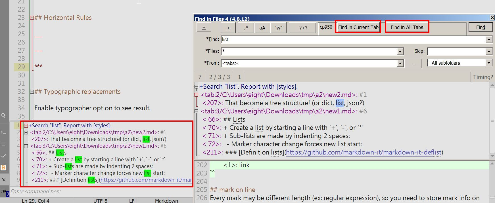

# Find in Files J - CudaText Plugin

This plugin enhances the default "Find in Files" (FiF) functionality in CudaText by providing additional features inspired by Notepad++. 

## Key Features

- **Result Display in Bottom Panel:**  
  Search results are displayed in the bottom panel.

- **Additional Search Options:**
  - **Find in Current Tab** button:  
    Allows you to search for keywords exclusively within the active document.  
    *Note:* This option bypasses the `files`, `skip`, `from`, and `depth` input fields.
  
  - **Find in All Tabs** button:  
    Allows you to search for keywords across all open documents.  
    *Note:* This option also ignores the `files`, `skip`, `from`, and `depth` input fields.

- **Quick Access via Bottom Bar:**  
  A dedicated bottom bar is provided to open and manage the search results panel with ease.

## Screenshot

